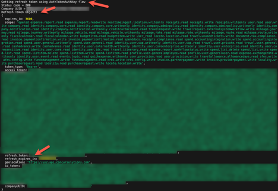

# Tutorial 3: Call SAP Concur APIs Using A Multiple Use Bearer Token

Use a refresh token to get a multiple use bearer token to call an API.

## Prerequisites

* You have created a Refresh Token from an API call and managed refresh token expiration using the previous [Refresh Token Management Automation tutorial](api-guides/authentication/concur-refresh-token-management/concur-refresh-token-management.html).
* SAP Concur instance credentials
* [Node.js](https://nodejs.org/)
* [GitHub account](https://github.com/)
* IDE or text editor

## You Will Learn

How to use a refresh token to get a multiple use bearer token to call an API.

## Regenerate Your Company Request Token

1. Go to the [**Company Request Token**](https://www.concursolutions.com/nui/authadmin/companytokens) screen.
2. Enter your **App ID** in the required field and click **Submit** to regenerate your company request token.
3. Copy/paste the Company UUID and company request token fields to a text file.
   
4. Click **OK** after you have saved this information to a text file.

## Setup the NodeJs App

1. Get the [`NodeJs sample code`](https://preview.developer.concur.com/api-guides/authentication/concur-calling-apis/CallingAPIs.js).
2. Open `SampleCode/Tutorial_3/CallingAPIs.js` in your IDE or text editor.

## Regenerate Your Credentials File

1. Type `node CallingAPIs.js` in terminal to run the app to generate your `credentials.json` file. This generates messages in the terminal that show the credentials object.

1. Fill in the empty fields in this file with the information in the credential object. You can use all of the information from your `credentials.json` file in the [Refresh Token Management Automation tutorial](api-guides/authentication/concur-refresh-token-management/concur-refresh-token-management.html) except for the company request token.

## Regenerate and Store Your Refresh Token in a JSON File

1. Run the app again. Since the app does not have a stored valid refresh token, the app will not find a valid refresh token in `refreshTokenObjectFile.json`.

1. The app will call the Oauth2 token endpoint using your credentials and regenerate your refresh token.

2. If the API call is successful, the refresh token data is converted from JSON format into a refresh token object and stored in the file `refreshTokenObjectFile.json`.

## Load Your Stored Refresh Token from a JSON File

1. Run the app again. Since the app now has a valid refresh token, the app will successfully load and check the validity of the file `refreshTokenObjectFile.json`.
2. Check for a successful validity check on the refresh token object loaded from `refreshTokenObjectFile.json`. If the refresh token object validity check is successful, the refresh token object will be stored in the app to make API calls.

### Call an API Using a Multiple Use Bearer Token

1. The app will use the validated refresh token in the refresh token object to make an API call to get a bearer token.

3. If the API call is successful, the bearer token data is converted from JSON format into a bearer token string.

1. The bearer token string is used to make the API call to the Profile from ID v4 endpoint.

1. If the API call is successful, the JSON response is displayed on the console.

