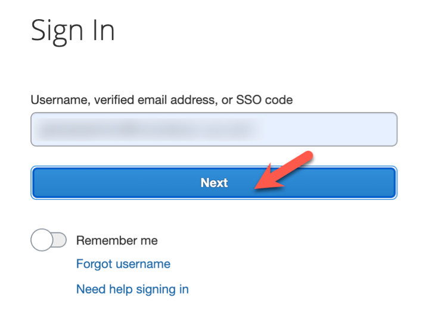
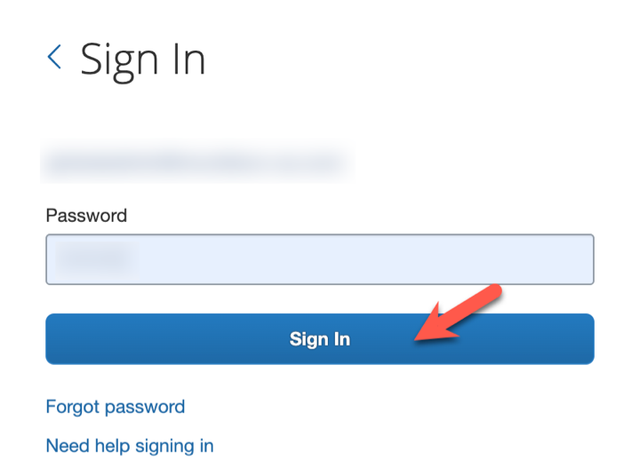

# Tutorial 1: Create Tokens Required for SAP Concur API Access

Create an app with a company request token to create a refresh token for API access.

## Prerequisites  

* SAP Concur instance credentials
* [Node.js](https://nodejs.org/)
* [GitHub account](https://github.com/)
* IDE or text editor

## You Will Learn

* How to create a new app.
* How to generate your company request token from the app.
* How to create your `credentials.json` file using information from the app and the company request token.
* How to create a refresh token from an API call using the `credentials.json` file.

## Login to Your Admin Panel

1. Login to your [**Concur admin panel**](https://www.concursolutions.com/nui/ocstool).
2. Enter your user ID and click **Next**.

3. Enter your password and click **Sign In**.
  

## Create a New App

1. Go to the [**OAuth 2.0 Application Management**](https://www.concursolutions.com/nui/ocstool) screen.
2. Click **Create new app**.

1. Fill in all of the required fields and add all of the grants and scopes you have access to.

1. Click **Submit** when the form is completed.
2. Copy and paste your Client ID and Client Secret to a text file.

3. Click **OK** when completed.

## Generate Your Company Request Token

1. Go to the [**Company Request Token**](https://www.concursolutions.com/nui/authadmin/companytokens) screen.
2. Enter your **App ID** in the required field and click **Submit** to generate your company request token.
3. Copy/paste the Company UUID and company request token fields to a text file.

4. Click **OK** after you have saved this information to a text file.

## Setup the Node.js App

1. Get the [Node.js sample code](https://github.com/SAP-samples/concur-api-samplecode).
2. Open `SampleCode/Tutorial_1/GetRefreshToken.js` in your IDE or text editor.

## Generate Your Credentials File

1. Type `node GetRefreshToken.js` in terminal to run the app to generate your `credentials.json` file. This generates messages in the terminal that show the credentials object.

2. Fill in the empty fields in this file with the information in the credential object.

## Generate Your Refresh Token

1. Run the app again. The app will call the Oauth2 /token endpoint using your credentials and generate your refresh token.
2. Check if your credentials were transferred from the JSON file to the credentials object. 
3. Check for a successful validity check on the credentials object.
4. Check for a successful API call. The status code will be 2xx and the refresh token will be one of the refresh token object properties.

