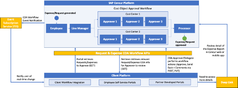
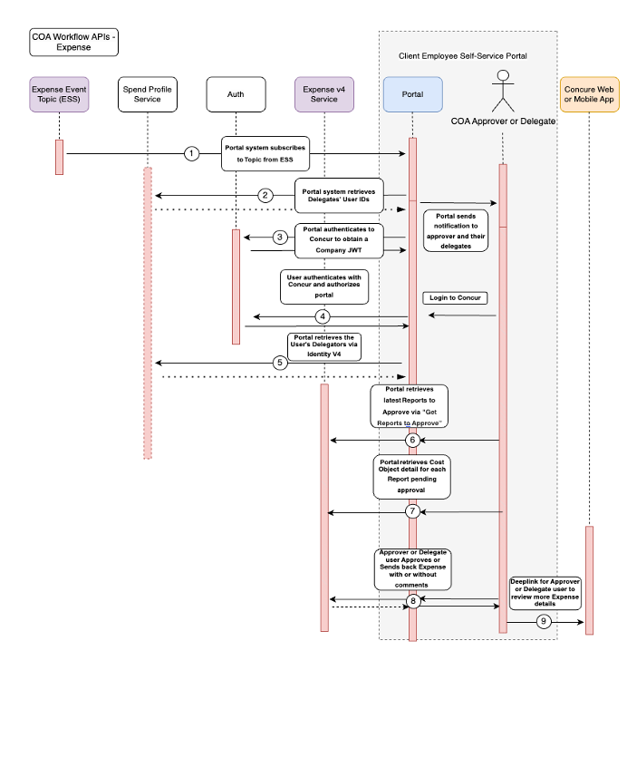

# Cost Object Workflow Integration Guide

Cost Object Approval Workflow v4 provides the ability for a user to create a workflow within their own external system or portal. Users can retrieve, view, and approve cost objects within reports through those systems, and deep link into  SAP Concur related systems for detailed information. Users are also able to receive necessary notifications regarding pending actions and workflow steps. This system can be used with both Expense and Request.

## Overall WorkFlow for Expense and Request

The Cost Object Approval Workflow Solution provides three core functions:

* Event notifications when Requests/Expenses have entered cost object approval workflow steps.
* Expense/Request workflow APIs that enable portal to retrieve Expenses/Requests that are ready for approvers and delegates to approve, review key cost object approval-related details, and approve and send back with or without comments to the employee. 
* Approver can deeplink from a given Expense or Request back into Concur Expense if the approver wants to view more detail.

### General Prerequisites

* The user must already exist as an active user in the SAP Concur solution with a Concur Expense or Request role. 
* This event subscription is only available to partners who have been granted access by SAP Concur.

Scopes required for Event Subscription Service:

Name|Description
---|---
events.topic.read|Access to ESS API.
expense.report.read|Get information about expense reports.

Scopes required for [Reports & Expense V4](/api-reference/expense/expense-report/v4.reports.html)

Name|Description|Endpoint
---|---|---
expense.report.read|Get information about expense reports.|GET
expense.report.readwrite|Read and write expense report headers.|PATCH
expense.report.workflowstatus.write|Approve or Send Back the Report in the workflow.|PATCH
user.read|Get User Information, necessary for `userID`.|GET

Optional Scopes:

Name|Description|Endpoint
---|---|---
spend.listitem.read|Read only access to spend list items `listItemId`.|GET
spend.list.read|Read only access to spend list and category details.|GET

Scopes required for [Deeplink URL Integration](/api-guides/expense/deeplink-url.html#scope-usage)

Name|Description|Endpoint
---|---|---
expense.report.read|Get information about expense reports.|GET
expense.report.readwrite|Read and write expense report headers.|PATCH
user.read|Get user information, necessary for `userID`.|GET

## Solution Steps for Expense

1. Portal system subscribes to an **Enhanced Expense [Event Topic](/event-topics/expense/v4.expense-events.html) from ESS that sends a unique event for every Cost Object Approval Approver and every approval step,** including cost object approval workflow events
   * When the report enters a cost object step that has multiple sub-branches, it will generate a single event consisting of multiple step instances.
   * When the report is moving within a cost object sub-branch it will generate a single event with one step instances.
   * ESS Expense Event would include a new `assignedUserId` field in the Status Changed Facts Schema.
   * Portal can also optionally listen to subsequent status change events (`eventType=statusChanged`) to further notify users after item has entered cost object approval workflow. For example, in case an item has been recalled (`A_RESU`), could post an additional notification to those users.
   * Reference: [See Concur Expense: Workflow – Cost Object Approval Setup Guide](https://www.concurtraining.com/customers/tech_pubs/Docs/_Current/SG_Exp/Exp_SG_Workflow_COA.pdf) and [Concur Request: Cost Object Approval Setup Guide](https://www.concurtraining.com/customers/tech_pubs/Docs/_Current/SG_Req/Req_SG_Workflow-COA.pdf) for detail on cost object approval workflow steps. In the examples in Section 4 of both guides, Dave/Cindy/Finn would each receive a notification event when the Report/Request first enters cost object approval workflow.

2. **Portal system retrieves all delegates' user IDs from the [Identify v4 API](/api-reference/profile/v4.identity.html)** for each approver that just received an event notification, and then portal sends a notification to each approver and delegate.
   * Portal uses `recipientId` obtained in ESS Expense Event to call Identity v4.
   * Portal receives back list of delegates for that user from Identity v4 which includes `userId` and `employeeNumber`.

3. Portal authenticates to SAP Concur system using [Company Level Authentication](/api-reference/authentication/company-auth.html) to obtain a Company JWT (token with necessary scopes required for API calls). 

4. **User authenticates with the SAP Concur system through the portal and authorizes the portal using [Authorization Grant](api-reference/authentication/apidoc.html#authorization-grant-)** – the User JWT obtained in this step will be used when user approves or sends back an expense (details in Authorization section).

5. **Portal retrieves the user's delegators via Identity v4** that can be used by the portal to then retrieve all the delegators' requests to approve in the next step. 

6. **Portal retrieves latest reports to approve via [Get Reports To Approve]() API which is enhanced to allow retrieval by Delegates.**
   * [Get Reports To Approve](api-reference/expense/expense-report/v4.reports-temporary.html#get-reports-to-approve) endpoint retrieves all reports that a user can approve as either an approver or delegate.
   * To retrieve reports pending approval for delegated employees, the parameter `includeDelegateApprovals` should be included in the API request as a boolean value. When this parameter is set to true, the API will return the reports that require approval from employees for whom the user has delegated authority.
   * If user is a delegate, the portal will iterate through to also retrieve each delegator’s reports to approve – by doing so, the user will have a complete list of all reports to approve.
   * This step would work for a user who has logged into the portal, regardless of whether they received a notification event as a user/delegate.

7. **Portal retrieves cost object detail for each report** pending approval.
   * The [cost objects for approver endpoint](/api-reference/expense/expense-report/v4.cost-objects.html) retrieves all cost objects for a report that the calling approver and/or that one of their delegators can approve.
   * If the workflow setting “Filter expenses to those that are applicable to cost object” is set to false, then this endpoint will return all cost objects related to the report regardless of if the approver has permission to approve them.

8. **[Approver or delegate user approves or sends back expense with or without comments](api-reference/expense/expense-report/v4.reports-temporary.html#get-reports-to-approve).**
   * Approve function is used to advance the specified report in the workflow and may require additional approvals based on configuration. If the report was in the processing payment status, it will be moved to the paid status. The function requires several parameters, including the unique identifiers of the user, the context type (which determines the user's access level), and the report itself. Additionally, users can optionally provide the identifier of an adhoc approver or manager to whom the report should be forwarded. The function supports various response codes to indicate the success or failure of the approval process, with corresponding error messages provided in case of any issues.
   * The Send Back Report function provides a convenient way to return an expense report to the employee for necessary revisions. By utilizing this function, the report can be sent back to the user in an unsubmitted state, allowing them to make any required changes. Once the user resubmits the report, it will then undergo the complete workflow process once more, ensuring proper review and approval. The request must include the unique identifiers for the user, report, and context type.
   * These functions support delegates, validating the delegate’s user JWT and ensuring that the delegate has the right to approve or send back. 

9. A user wanting to review more Expense detail can deeplink from the portal to Concur Expense.
   * The [Deeplink URL Integration](/api-guides/expense/deeplink-url.html) documentation details how a portal can access a resource in Concur Expense.
   * Client would have to implement SAML 2 if using SSO to enable deeplink support. 

## Validation and Error Handling

* **Missing Events** – in the case that the portal does not receive events when requests have entered the cost object approval workflow, the portal would still be able to retrieve all requests to approve, review, and act on them.
* **Error Codes** – APIs will return common error codes for general outage, document no longer in approval, etc. These will be detailed in API documentation.  
* **Error Codes – Expense**
   * **400 Bad Request**: Indicates a problem with the request, such as missing context, incomplete review, invalid action, or missing approver. The error response will provide specific error descriptions.
   * **401 Unauthorized**: Missing authorization header.
   * **403 Forbidden**: User is not authorized to read the report.
   * **404 Not Found**: Report ID not found.
   * **500 Internal Server Error**: An error occurred on the server.

## Authorization Requirements

### User Authentication and Authorization

* The portal will need to use the regular 3-legged OAuth2 grant [Authorization Grant](/api-reference/authentication/apidoc.html#authorization-grant-), which would redirect the user to the SAP Concur login page where they would get asked for a SAP Concur password and email/OTP authentication (SSO not currently available), and then explicitly authorize the portal application.
* If user authentication and authorization is done from a browser (client side app), then the portal would need to use the [PKCE for OAuth 2.0](https://oauth.net/2/pkce/) extension, which allows the portal to use the flow without exposing their app's client secret.

### Company Level Authentication

* The portal application will need to use [Company Level Authentication](api-reference/authentication/company-auth.html) to obtain an access token and a refresh token on the Company’s behalf ([Instructions for obtaining Company JWT](/api-reference/authentication/company-refresh-tool.html)). 

