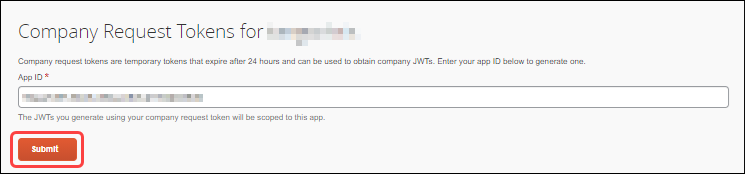
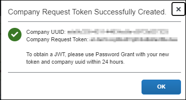

# Company Request Token Self-Service Tool

The Company Request Token tool enables clients to generate a Company Request Token. A Company Request Token is required by some integrations, and can also be used to request an Access/Refresh Token (JSON web token or JWT) for connecting to APIs in the SAP Concur platform. The Company Request Tokens Tool also enables clients to generate a replacement Company Request Token without assistance from SAP Concur Support if their Company Request Token expires or is lost.

## Authentication Workflow Options

The Company Request Tokens page can be used to generate only a Company Request token, or may be used to additionally generate an Access/Refresh token for the company. The different tokens are:

* Request Token: This token can be generated to use with integrations, using the integration's App ID (also known as Client ID). Clients who are using an integration between SAP Concur and another SAP product can get the App ID from the respective [integration setup guide](https://www.concurtraining.com/customers/tech_pubs/Integration/_CCC_SAP_Integrations.htm). Once generated, the Request Token is used in the admin interface for the SAP product. This authentication flow does not require the customer to generate an App ID/Client ID or Client Secret.

* Access/Refresh Token: This token is created after creating the Company Request token. This token can be used with the Concur API platform, and is sometimes necessary for integrations. If you are creating an Access/Refresh token, you need to obtain a Client ID and Client Secret via the [OAuth 2.0 Application Management tool](./oauth2-app-mgmt-tool.html).

## Prerequisites

The SAP Concur administrator must have the correct user role to access the Company Request Tokens page:
* Professional Edition: Web Services Administrator
* Standard Edition: Can Administer
  
**NOTE**: If a company administrator needs to use this feature and does not have the proper permissions, they should contact the company's SAP Concur administrator.

## Generating a Company Request Token

1. Click **Administration** > **Company** > **Authentication Admin**. The **Authentication Administration** page appears.

2. Click **Company Request Token**. The admin **Company Request Tokens** page appears.

    

3. In the **App ID** field, type the **App ID or Client ID**.
    >**NOTE**: Clients can obtain a **App ID or Client ID** through one of the following methods:

* Clients with Client Web Services who have requested access to the self-service tool for application management can generate a Client ID using the [OAuth 2.0 Application Management tool](./oauth2-app-mgmt-tool.html).
* Clients who are using an integration between SAP Concur and another SAP product can get the App ID from the respective [integration setup guide](https://www.concurtraining.com/customers/tech_pubs/Integration/_CCC_SAP_Integrations.htm).

    

1. Click **Submit**. The **Company Request Token Successfully Created** dialog appears, displaying the **Company UUID** and the **Company Request Token**. Before clicking **OK**, record the **Company UUID** and the **Company Request Token**.

    

    >**NOTE**: The Company Request Token expires after 24 hours. If you cannot complete the authentication workflow within 24 hours of generating the Company Request Token, you must regenerate the token before completing the workflow. You can regenerate the Company Request Token by reentering the App ID/Client ID and clicking **Submit** again.

## Generating an Access/Refresh Token

The admin can use the Company Request Token to generate an Access/Refresh Token (Company JWT). 

To obtain an Access/Refresh Token, follow the steps on the **Company Request Tokens** page:

Replace the following values and run the Password Grant CURL command to obtain an Access Token and Refresh Token.

   * `client_id`
   * `client_secret`
   * `company_UUID`
   * `request_token`

  ```
  curl -X POST 'https://us.api.concursolutions.com/oauth2/v0/token' \ -H
  'Content-Type: application/x-www-form-urlencoded' \ --data-urlencode
  'client_id=<client_id>' \ --data-urlencode
  'client_secret=<client_secret>' \ --data-urlencode
  'grant_type=password' \ --data-urlencode
  'username=<company_UUID>' \ --data-urlencode
  'password=<request_token>' \ --data-urlencode
  'credtype=authtoken'
  ```

For more information, refer to the [Password Grants](https://developer.concur.com/api-reference/authentication/apidoc.html#password_grant).

A successful response will be in the following form:

  ```
  CURL response
  HTTP/1.1 200 OK
  Content-Type: application/json
  Date: date-requested
  Content-Length: 3397
  Connection: Close
  {
    "expires_in": "3600",
    "scope": "<app scopes>",
    "token_type": "Bearer",
    "access_token": "<access_token>",
    "refresh_token": "<refresh_token>",
  "geolocation":"https://us.api.concursolutions.com/oauth2/v0/token"
  }
  ```
* The Access Token (Company JWT) has a lifetime of 1 hour and can be used to call SAP Concur APIs and connect some SAP cross-product integrations. The Access Token can be refreshed by calling the Refresh Grant. The application must store the Refresh Token in order to be able to continue refreshing the Access Token when it expires.
For more information on Refresh Grants, refer to [Refreshing a Token](https://developer.concur.com/api-reference/authentication/apidoc.html#refresh_token).
* If the Refresh Token is lost, expires, or is revoked, you must generate a new request token. After you have completed the steps on the **Company Request Tokens** page, you have completed the process of obtaining the Access/Refresh Token and can start making calls to SAP Concur APIs.