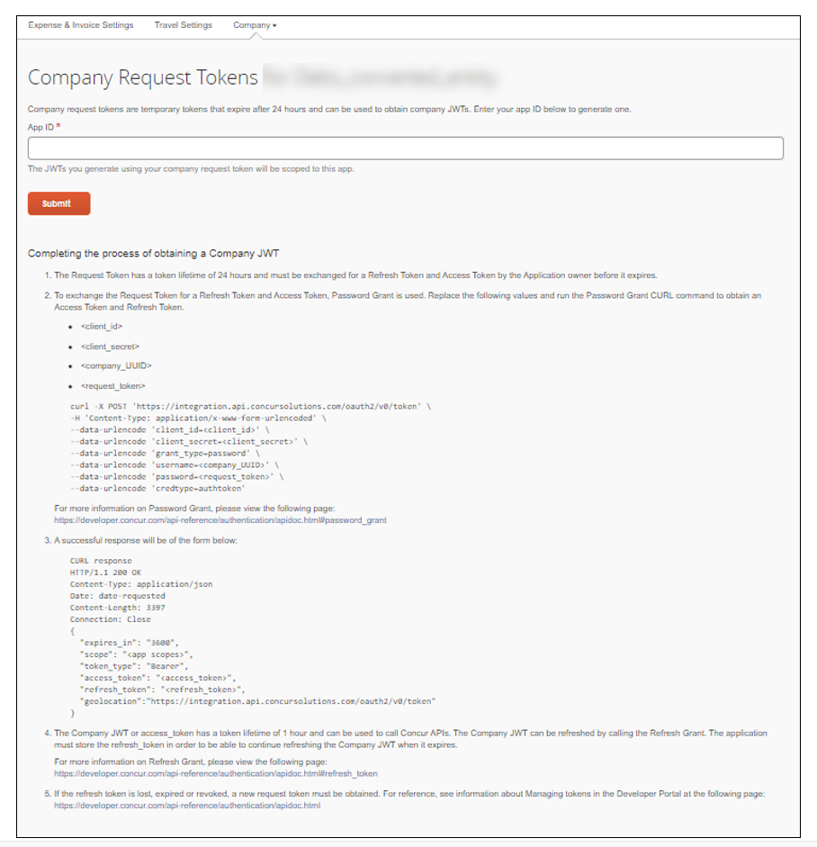
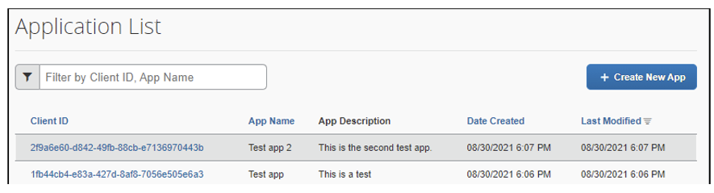

# Company Request Token Self-Service Tool

The Company Request Token tool enables clients to generate a Company Request Token without assistance from SAP Concur support. A Company Request Token is required to request a JSON web token (JWT) when connecting to APIs in the SAP Concur platform. This tool also enables clients to generate a replacement Company Request Token without assistance from SAP Concur support if their Company Request Token expires or is lost.

## Limitations

This tool is currently only available in the US (North America) and EMEA data centers. All other data centers can contact Client Web Services for assistance.

## Company Authentication Workflow

There are three steps for completing the company authentication workflow:

1. Obtain a Client ID and Client Secret via the [OAuth 2.0 Application Management tool](./oauth2-app-mgmt-tool.html) or receive your Client ID and Client Secret directly from your SAP Concur contact.
2. Obtain a Company Request Token via the Company Request Token tool.
3. Exchange the Company Request Token for Access and Refresh Tokens.

Admins with the required permissions will have a link to the **Company Request Token** page on the **Administration** > **Company** > **Authentication Administration** page.



On the **Company Request Tokens** page, the admin enters their **Client ID** in the **App ID** field, and then clicks **Submit**.

>**NOTE**: Clients can obtain a **Client ID** through one of the following methods:

* Clients with Client Web Services who have requested access to the self-service tool for application management can generate a Client ID using the self-service tool.
Clients who are using an integration between SAP Concur and another SAP product can get the App ID from the respective [integration setup guide](https://www.concurtraining.com/customers/tech_pubs/Integration/_CCC_SAP_Integrations.htm).
* Clients who do not have Client Web Services or an SAP Concur integration can contact SAP Concur support to obtain an App ID as needed.

The **Company Request Token Successfully Created** dialog appears.



This dialog contains the Company UUID and the Company Request Token. The admin must copy and save both the Company UUID and the Company Request Token before signing out or navigating away from this dialog.

The admin can use the Company Request Token to generate a Company JWT, using the Password Grant process or the tools required to configure the integration. Instructions for the Password Grant process are on the Company Request Token page, as well as the [SAP Concur Developer Center](https://developer.concur.com/api-reference/authentication/apidoc.html#password_grant).

The Company Request Token has a token expiry lifetime of 24 hours. The admin must obtain the Company JWT within that 24-hour period. If the Company Request Token expires or is lost, the admin can access the Company Request Tokens page again, enter their Client ID into the App ID field, and then generate a replacement Company Request Token.

## Company Request Token UI

1. Click **Administration** > **Company** > **Authentication Admin**. The **Authentication Administration** page appears.
2. Click **Company Request Token**. The admin **Company Request Tokens** page appears.

    

3. In the **App ID** field, type the **Client ID**.

    

4. Click **Submit**. The **Company Request Token Successfully Created** dialog appears. Before clicking **OK**, record the **Company UUID** and the **Company Request Token**.

    

    >**NOTE**: The Company Request Token expires after 24 hours. If you cannot complete the workflow within 24 hours of generating the Company Request Token, you must regenerate the token before completing the workflow. You can regenerate the Company Request Token by reentering the Client ID in the App ID and clicking Submit again.

5. To obtain a Company JWT, follow the steps on the **Company Request Tokens** page:

*  To exchange the Request Token for a Refresh Token and an Access Token, replace the following values and run the Password Grant CURL command to obtain an Access Token and Refresh Token.

   * `client_id`
   * `client_secret`
   * `company_UUID`
   * `request_token`

  ```
  curl -X POST 'https://us.api.concursolutions.com/oauth2/v0/token' \ -H
  'Content-Type: application/x-www-form-urlencoded' \ --data-urlencode
  'client_id=<client_id>' \ --data-urlencode
  'client_secret=<client_secret>' \ --data-urlencode
  'grant_type=password' \ --data-urlencode
  'username=<company_UUID>' \ --data-urlencode
  'password=<request_token>' \ --data-urlencode
  'credtype=authtoken'
  ```

For more information, refer to the [Password Grants](https://developer.concur.com/api-reference/authentication/apidoc.html#password_grant).

* A successful response will be in the following form:

  ```
  CURL response
  HTTP/1.1 200 OK
  Content-Type: application/json
  Date: date-requested
  Content-Length: 3397
  Connection: Close
  {
    "expires_in": "3600",
    "scope": "<app scopes>",
    "token_type": "Bearer",
    "access_token": "<access_token>",
    "refresh_token": "<refresh_token>",
  "geolocation":"https://us.api.concursolutions.com/oauth2/v0/token"
  }
  ```
* The Company JWT or `access_token` has a token lifetime of 1 hour and can be used to call SAP Concur APIs. The Company JWT can be refreshed by calling the Refresh Grant. The application must store the `refresh_token` in order to be able to continue refreshing the Company JWT when it expires.
For more information on Refresh Grants, refer to [Refreshing a Token](https://developer.concur.com/api-reference/authentication/apidoc.html#refresh_token).
* If the `refresh_token` is lost, expires, or is revoked, a new request token must be obtained. For more information, refer to [Authentication](https://developer.concur.com/api-reference/authentication/apidoc.html). After you have completed the steps on the **Company Request Tokens** page, you have completed the process of obtaining the Company JWT and can start making calls to SAP Concur APIs.
