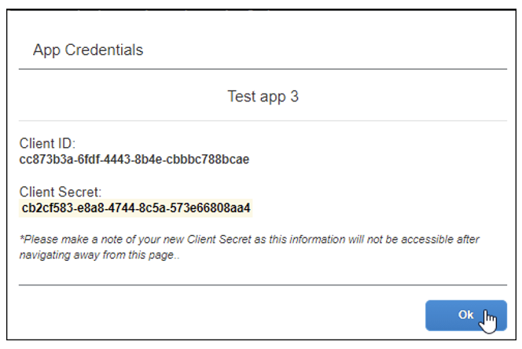

# OAuth 2.0 Application Management Tool

The OAuth 2.0 Application Management tool enables clients who have Client Web Services to generate Client IDs (App IDs) and Client Secrets without contacting SAP Concur support. It also enables clients to create OAuth 2.0 compliant applications. In order to complete the workflow, you must first contact Client Web Services to request that the OAuth 2.0 Application Management tool be enabled for your entity.

Once the tool is enabled, an admin with the Web Services Administrator role will have a link to the OAuth 2.0 Application Management tool on the Authentication Administration page.

>**NOTE**: For admins working with Standard entities, a user with the **Can Administer** permission has the Web Services Administrator role.

The OAuth 2.0 Application Management tool enables clients to do the following:

* Create new OAuth 2.0 apps.
* Edit previously created OAuth 2.0 apps.
* Generate Client IDs (App IDs) and Client Secrets.
*	Generate new Client Secrets for previously created apps.
*	Search for and sort OAuth 2.0 applications.
*	View information about previously created apps such as Client ID, app description, creation date.

## Limitations

This tool is currently only available in the US (North America) and EMEA data centers. All other data centers can contact Client Web Services for assistance.

## Using the Tool

When the tool is enabled, the Web Services Admin has a link to the OAuth 2.0 Application Management tool when they navigate to the **Administration** > **Company** > **Authentication Admin** page.

Clicking OAuth 2.0 Application Management opens the **Application List** page.

On the **Application List** page, is a list of previously created applications. Clicking the **Client ID** for an application opens the **App Details** page for that app.

### To Create a New App

Click **Create New App**.

>**NOTE**: The App Type is read-only.

Populate the fields as indicated below.

Field Name|	Definition|	Required|	Description
---|---|---|---
`App Name`|	String|	Y	|Name of the App. NOTE: Include Company, Partner, or Team Name
`App Type`|	NA|	NA|	This field defaults to Client and is read-only.
`Allowed Grants`|	Selected Grants|	Y	|In order to obtain a token, the client application needs to call the OAuth2 endpoint using various grants depending on the authentication scenarios required. NOTE: For more information, refer to Authorization Grants (https://developer.concur.com/api-reference/authentication/apidoc.html#auth_grant).
`Allowed Scopes`|	Selected Scopes|	Y	|Scopes limit access to the APIs required for your application. All scopes listed on the Developer Center are available in the tool. Scopes that are not listed can be requested. NOTE: For more information, refer to [Scopes](https://developer.concur.com/api-reference/authentication/scopes.html)
SAP Detokenizer|	SAP Integration Cloud Suite (ICS) Only|	N|	This checkbox is only enabled for SAP ICS client apps.

Click **Submit**. The **App Credentials** page appears.

The **App Credentials** page displays the **Client ID** and **Client Secret**. Before clicking **OK**, record the **Client ID** and **Client Secret**. They will be required to obtain a **Company Request Token**.

Once you click **OK** the new application appears in the list on the **Application List** page. You can confirm the details of the app, including the **Client ID** and **Client Secret** by clicking the **Client ID** in the list on the **Application List** page.
