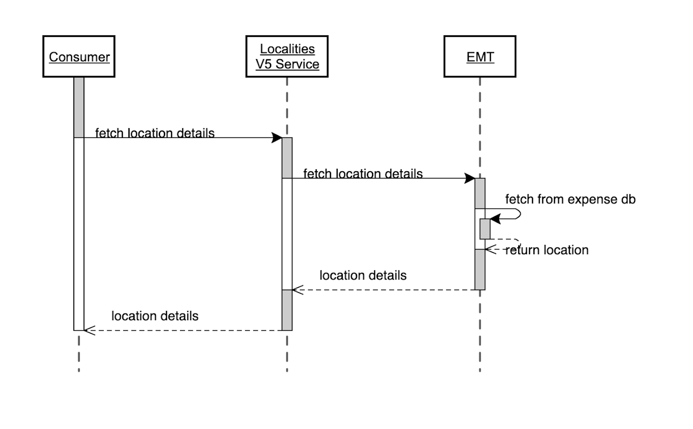

# Localities v5

This API acts as a single source of truth for location-related information, including countries, subdivisions, and specific localities. It enables consistent and reliable data access across multiple business functions and partner systems.

## Prior Versions

* Locations v3 documentation is available [here](https://developer.concur.com/api-reference/common/locations/v3.locations.html)

## <a name="limitations"></a>Limitations

Access to this documentation does not provide access to the API.

## <a name="sequence-diagram"></a>Sequence Diagram

A high-level diagram of the Localities Service flow, showing how clients retrieve locality data via endpoints.



## <a name="products-editions"></a>Products and Editions

* Concur Expense Professional Edition
* Concur Expense Standard Edition
* Concur Travel Allowance Professional Edition
* Concur Travel Allowance Standard Edition
* Concur Invoice Professional Edition
* Concur Invoice Standard Edition
* Concur Request Professional Edition
* Concur Request Standard Edition

## <a name="scope-usage"></a>Scope Usage

Name| Description             |Endpoint
---|-------------------------|---
`locality.read`| getCountries            |`GET `
`locality.read`| getCountryByCode        |`GET `
`locality.read`| getLocations            |`GET `
`locality.read`| getLocationByLocalityId |`GET `
`locality.read`| getSubdivisions         |`GET `
`locality.read`| getSubdivisionByCode    |`GET `
`locality.read`| getAdminRegions         |`GET `
`locality.read`| getAdminRegionById      |`GET `

## <a name="access-token-usage"></a>Access Token Usage

This API supports both company level and user level access tokens.

## <a name="endpoints"></a>Get Countries

Retrieves a countries list along with currency codes.

### Scopes

`locality.read` - Refer to [Scope Usage](#scope-usage) for full details.

#### URI

```shell
GET https://{region}.api.concursolutions.com/localities/v5/countries
```

#### Parameters

None

#### Payloads

* Request: None
* Response: [`CountryListResponse`](#countrylistresponse-schema)

### Examples

#### Request
```shell
GET https://us2.api.concursolutions.com/localities/v5/countries
Accept: application/json 
Accept-Language: en 
Authorization: Bearer ${ACCESS_TOKEN} 
```
#### Response

```shell
HTTP/1.1 200 OK
Content-Type: application/json
```

```json
{
  "countries": [
    {
      "code": "AF",
      "active": true,
      "names": [
        {
          "name": "AFGHANISTAN",
          "langCode": "en"
        }
      ],
      "currencies": [
        {
          "code": "AFN"
        }
      ],
      "links": [
        {
          "rel": "self",
          "href": "https://us2.api.concursolutions.com/localities/v5/countries/AF"
        }
      ]
    }
  ]
}
```

## Get Country by Country Code

Retrieves country details given a country code.

### Scopes

`locality.read` - Refer to [Scope Usage](#scope-usage) for full details.

#### URI

```shell
GET https://{region}.api.concursolutions.com/localities/v5/countries/{countryCode}
```

#### Parameters

Name|Type|Format|Description
---|---|---|---
`countryCode`|`string`|-|**Required** Two-letter ISO countryCode.

#### Payloads

* Request: None
* Response: [`CountryByCodeResponse`](#countrybycoderesponse-schema)

### Examples

#### Request
```shell
GET https://us2.api.concursolutions.com/localities/v5/countries/AF
Accept: application/json 
Accept-Language: en 
Authorization: Bearer ${ACCESS_TOKEN}
```

#### Response

```shell
HTTP/1.1 200 OK
Content-Type: application/json
```

```json
{
  "code": "AF",
  "active": true,
  "numCode": 826,
  "alpha3Code": "GBR",
  "distanceUnitCode": "MILE",
  "names": [
    {
      "name": "AFGHANISTAN",
      "langCode": "en"
    }
  ],
  "currencies": [
    {
      "code": "AFN"
    }
  ],
  "links": [
    {
      "rel": "self",
      "href": "https://us2.api.concursolutions.com/localities/v5/countries/AF"
    }
  ]
}
```

## Get Locations

Returns details of a locality given a legacy `Location Name Key`/`Locality Code`/`Location Name Id` or matching the given `search text` for a given company.

### Scopes

`locality.read` - Refer to [Scope Usage](#scope-usage) for full details.

#### URI

```shell
GET https://{region}.api.concursolutions.com/localities/v5/locations?locationNameKey={}&locationNameId={}&locCode={}&searchText={}

Fetches locality data based on query parameters. 
```

#### Parameters

Only one of these parameters at a time is required: `locationNameKey`, `locationNameId`, `locCode`, or `searchText`.

Parameter| Type|Required|Condition|Description
---|-----|----|----|---
`locationNameKey`| `Integer` | Conditional | Required if others (locationNameId,locCode or searchText ) not present |Unique key for the location name 
`locationNameId`| `String` | Conditional | Required if others (locationNameKey,locCode or searchText ) not present |UUID identifier of the location name 
`locCode`| `String` | Conditional | Required if others (locationNameKey,locationNameId or searchText ) not present |Location code
`searchText`| `String` | Conditional | Required if others (locationNameKey,locCode or locationNameId ) not present |Free-text for location search
`adminRegionId `| `String` | Optional | Only valid with searchText |Filter by adminRegionId
`countryCode`| `String` | Optional | Only valid with searchText |ISO country code 
`subdivisionCode`| `String` | Optional | Only valid with searchText |Subdivision (e.g., state, province) code

#### Payloads

* Request: None
* Response: [`LocationListResponse`](#locationlistresponse-schema)

### Examples

#### Request
```shell
GET https://us2.api.concursolutions.com/localities/v5/locations?locCode=DEMUC
Accept: application/json 
Accept-Language: en 
Authorization: Bearer ${ACCESS_TOKEN}
```

#### Response

```shell
HTTP/1.1 200 OK
Content-Type: application/json
```

```json
{
  "locations": [
    {
      "legacyKey": 5616,
      "code": "DEMUC",
      "id": "0c3f69f8-8867-4fad-9bc9-ade77fc05683",
      "timeZoneOffset": 60,
      "active": true,
      "point": {
        "latitude": 48.15,
        "longitude": 11.583333
      },
      "names": [
        {
          "id": "dff1ef47-b11b-114d-aed4-929e3c5d73d7",
          "name": "Munich",
          "legacyKey": 5705,
          "active": true,
          "langCode": "en"
        }
      ],
      "administrativeRegion": {
        "id": "adminRegionId",
        "names": [
          {
            "name": "BEDFORD COUNTY",
            "langCode": "en"
          }
        ],
        "countryCode": "US",
        "subDivCode": "US-TX",
        "links": [
          {
            "rel": "self",
            "href": "https://us2.api.concursolutions.com/localities/v5/adminRegions/3b353fe3-5e4d-4a7a-8230-8eb44db254d0"
          }
        ]
      },
      "country": {
        "code": "US",
        "names": [
          {
            "name": "USA",
            "langCode": "en"
          }
        ],
        "links": [
          {
            "rel": "self",
            "href": "https://us2.api.concursolutions.com/localities/v5/countries/US"
          }
        ]
      },
      "subDivision": {
        "code": "US-TX",
        "names": [
          {
            "name": "Texas",
            "langCode": "en"
          }
        ],
        "links": [
          {
            "rel": "self",
            "href": "https://us2.api.concursolutions.com/localities/v5/subDivisions/US-TX"
          }
        ]
      },
      "links": [
        {
          "rel": "self",
          "href": "https://us2.api.concursolutions.com/localities/v5/locations/0c3f69f8-8867-4fad-9bc9-ade77fc05683"
        }
      ]
    }
  ]
}
```

## Get Location by Locality Id

Returns location details given a Locality Id for a given company.

### Scopes

`locality.read` - Refer to [Scope Usage](#scope-usage) for full details.

#### URI

```shell
GET https://{region}.api.concursolutions.com/localities/v5/locations/{localityId}
```

#### Parameters

Name|Type|Format|Description
---|---|---|---
`localityId`|`string`|-|**Required** Valid UUID of the Locality.

#### Payloads

* Request: None
* Response: [`Location`](#location-schema)

### Examples

#### Request
```shell
GET https://us2.api.concursolutions.com/localities/v5/locations/0c3f69f8-8867-4fad-9bc9-ade77fc05683
Accept: application/json 
Accept-Language: en 
Authorization: Bearer ${ACCESS_TOKEN}
```

#### Response

```shell
HTTP/1.1 200 OK
Content-Type: application/json
```

```json
{
  "legacyKey": 5616,
  "code": "DEMUC",
  "id": "0c3f69f8-8867-4fad-9bc9-ade77fc05683",
  "timeZoneOffset": 60,
  "active": true,
  "point": {
    "latitude": 48.15,
    "longitude": 11.583333
  },
  "names": [
    {
      "id": "dff1ef47-b11b-114d-aed4-929e3c5d73d7",
      "name": "Munich",
      "legacyKey": 5705,
      "active": true,
      "langCode": "en"
    }
  ],
  "administrativeRegion": {
    "id": "adminRegionId",
    "names": [
      {
        "name": "BEDFORD COUNTY",
        "langCode": "en"
      }
    ],
    "countryCode": "US",
    "subDivCode": "US-TX",
    "links": [
      {
        "rel": "self",
        "href": "https://us2.api.concursolutions.com/localities/v5/adminRegions/3b353fe3-5e4d-4a7a-8230-8eb44db254d0"
      }
    ]
  },
  "country": {
    "code": "US",
    "names": [
      {
        "name": "USA",
        "langCode": "en"
      }
    ],
    "links": [
      {
        "rel": "self",
        "href": "https://us2.api.concursolutions.com/localities/v5/countries/US"
      }
    ]
  },
  "subDivision": {
    "code": "US-TX",
    "names": [
      {
        "name": "Texas",
        "langCode": "en"
      }
    ],
    "links": [
      {
        "rel": "self",
        "href": "https://us2.api.concursolutions.com/localities/v5/subDivisions/US-TX"
      }
    ]
  },
  "links": [
    {
      "rel": "self",
      "href": "https://us2.api.concursolutions.com/localities/v5/locations/0c3f69f8-8867-4fad-9bc9-ade77fc05683"
    }
  ]
}

```
## Get Subdivisions

Retrieves list of subdivisions given country code.

### Scopes

`locality.read` - Refer to [Scope Usage](#scope-usage) for full details.

#### URI

```shell
GET https://{region}.api.concursolutions.com/localities/v5/subdivisions?countryCode={countryCode}
```
#### Parameters

Name|Type|Format|Description
---|---|---|---
`countryCode`|`string`|-|**Required** Two letter ISO countryCode.

#### Payloads

* Request: None
* Response: [`SubdivisionListResponse`](#subdivisionlistresponse-schema)


### Examples

#### Request
```shell
GET https://us2.api.concursolutions.com/localities/v5/subdivisions?countryCode=AU
Accept: application/json 
Accept-Language: en 
Authorization: Bearer ${ACCESS_TOKEN}
```

#### Response

```shell
HTTP/1.1 200 OK
Content-Type: application/json
```

```json
{
  "subdivisions": [
    {
      "code": "AU-QLD",
      "active": true,
      "names": [
        {
          "name": "Queensland",
          "langCode": "en"
        }
      ],
      "countryCode": "AU",
      "links": [
        {
          "rel": "self",
          "href": "https://us2.api.concursolutions.com/localities/v5/subDivisions/AU-QLD"
        },
        {
          "rel": "country",
          "href": "https://us2.api.concursolutions.com/localities/v5/countries/AU"
        }
      ]
    }
  ]
}
```

## Get Subdivision by Subdivision Code

Retrieve subdivision details given country code and subdivision codes.

### Scopes

`locality.read` - Refer to [Scope Usage](#scope-usage) for full details.

#### URI

```shell
GET https://{region}.api.concursolutions.com/localities/v5/subdivisions/{subdivisionCode}
```
#### Parameters

Name|Type|Format|Description
---|---|---|---
`subdivisionCode`|`string`|-|**Required** ISO 3166-2 Subdivision code.

#### Payloads

* Request: None
* Response: [`SubdivisionByCodeResponse`](#subdivisionbycoderesponse-schema)


### Examples

#### Request
```shell
GET https://us2.api.concursolutions.com/localities/v5/subdivisions/AU-QLD
Accept: application/json 
Accept-Language: en 
Authorization: Bearer ${ACCESS_TOKEN}
```

#### Response

```shell
HTTP/1.1 200 OK
Content-Type: application/json
```

```json
{
  "code": "AU-QLD",
  "active": true,
  "names": [
    {
      "name": "Queensland",
      "langCode": "en"
    }
  ],
  "countryCode": "AU",
  "links": [
    {
      "rel": "self",
      "href": "https://us2.api.concursolutions.com/localities/v5/subDivisions/AU-QLD"
    },
    {
      "rel": "country",
      "href": "https://us2.api.concursolutions.com/localities/v5/countries/AU"
    }
  ]
}
```

## Get AdminRegions

Retrieve list of administrative regions given country code and subdivision code.

### Scopes

`locality.read` - Refer to [Scope Usage](#scope-usage) for full details.

#### URI

```shell
GET https://{region}.api.concursolutions.com/localities/v5/adminRegions?countryCode={countryCode}&subdivisionCode={subdivisionCode}
```
#### Parameters

Name|Type|Format|Description
---|---|---|---
`countryCode`|`string`|-|**Required** Two letter ISO countryCode.
`subdivisionCode`|`string`|-|**Required** ISO 3166-2 Subdivision code.

#### Payloads

* Request: None
* Response: [`AdminRegionList`](#adminregionlist-schema)


### Examples

#### Request
```shell
GET https://us2.api.concursolutions.com/localities/v5/adminRegions?countryCode=US&subdivisionCode=US-TX
Accept: application/json 
Accept-Language: en 
Authorization: Bearer ${ACCESS_TOKEN}
```

#### Response

```shell
HTTP/1.1 200 OK
Content-Type: application/json
```

```json
{
  "adminRegions": [
    {
      "id": "eb44a08e-0d41-45f4-863a-aa8bb03f90e0",
      "active": true,
      "names": [
        {
          "name": "ANDERSON COUNTY",
          "langCode": "en"
        }
      ],
      "country": {
        "code": "US",
        "links": [
          {
            "rel": "self",
            "href": "https://us2.api.concursolutions.com/localities/v5/countries/US"
          }
        ]
      },
      "subDivision": {
        "code": "US-TX",
        "links": [
          {
            "rel": "self",
            "href": "https://us2.api.concursolutions.com/localities/v5/subdivisions/US-TX"
          }
        ]
      },
      "links": [
        {
          "rel": "self",
          "href": "https://us2.api.concursolutions.com/localities/v5/adminRegions/eb44a08e-0d41-45f4-863a-aa8bb03f90e0"
        }
      ]
    },
    {
      "id": "e9f81fa1-4823-4729-9faf-5f90eb96464c",
      "active": true,
      "names": [
        {
          "name": "ANDREWS COUNTY",
          "langCode": "en"
        }
      ],
      "country": {
        "code": "US",
        "links": [
          {
            "rel": "self",
            "href": "https://us2.api.concursolutions.com/localities/v5/countries/US"
          }
        ]
      },
      "subDivision": {
        "code": "US-TX",
        "links": [
          {
            "rel": "self",
            "href": "https://us2.api.concursolutions.com/localities/v5/subdivisions/US-TX"
          }
        ]
      },
      "links": [
        {
          "rel": "self",
          "href": "https://us2.api.concursolutions.com/localities/v5/adminRegions/e9f81fa1-4823-4729-9faf-5f90eb96464c"
        }
      ]
    }
  ]
}
```

## Get AdminRegion by Admin Region Id 

Retrieve administrative region details given Admin Region Id.

### Scopes

`locality.read` - Refer to [Scope Usage](#scope-usage) for full details.

#### URI

```shell
GET https://{region}.api.concursolutions.com/localities/v5/adminRegions/{adminRegionId}
```
#### Parameters

Name|Type|Format|Description
---|---|---|---
`adminRegionId`|`string`|-|**Required** Valid UUID of the Admin Region.

#### Payloads

* Request: None
* Response: [`AdminRegionResponse`](#adminregionresponse-schema)


### Examples

#### Request
```shell
GET https://us2.api.concursolutions.com/localities/v5/adminRegions/3b353fe3-5e4d-4a7a-8230-8eb44db254d0
Accept: application/json 
Accept-Language: en 
Authorization: Bearer ${ACCESS_TOKEN}
```

#### Response

```shell
HTTP/1.1 200 OK
Content-Type: application/json
```

```json
{
  "id": "3b353fe3-5e4d-4a7a-8230-8eb44db254d0",
  "active": true,
  "names": [
    {
      "name": "ANDERSON COUNTY",
      "langCode": "en"
    }
  ],
  "country": {
    "code": "US",
    "links": [
      {
        "rel": "self",
        "href": "https://us2.api.concursolutions.com/localities/v5/countries/US"
      }
    ]
  },
  "subDivision": {
    "code": "US-TN",
    "links": [
      {
        "rel": "self",
        "href": "https://us2.api.concursolutions.com/localities/v5/subdivisions/US-TN"
      }
    ]
  },
  "links": [
    {
      "rel": "self",
      "href": "https://us2.api.concursolutions.com/localities/v5/adminRegions/3b353fe3-5e4d-4a7a-8230-8eb44db254d0"
    }
  ]
}
```

## <a name="schema"></a>Schemas

### <a name="locationlistresponse-schema"></a> LocationListResponse

Name| Type| Format                                                                         |Description
---|-----|--------------------------------------------------------------------------------|---
`Locations`| `List` | [`Location Schema`](#location-schema)            |All active locations for the given company Id.

### <a name="location-schema"></a> Location

Name| Type      | Format                                                                        |Description
---|-----------|-------------------------------------------------------------------------------|---
`legacyKey`| `integer` | -                                                                             |Numeric Identifier for the location.
`code`| `string`  | -                                                                             |Location code.
`id`| `string`  | -                                                                             |Unique Identifier of the location.
`timeZoneOffset`| `integer` | -                                                                             |Time zone offset of the location (in minutes).
`active`| `boolean` | `true`/`false`                                                                    |Whether the location is active.
`point`| `object`  | [`Point Schema`](#point-schema)                                               |Geographical coordinates of the location.
`names`| `list`    | [`LocationName Schema`](#locationname-schema)                                 |Names for the location.
`administrativeRegion`| `object`  | [`AdminRegion Schema`](#adminregion-schema)                    |Administrative region details of the location.
`country`| `object`  | [`Code Schema`](#code-schema)                                                 |Country associated with the location.
`subDivision`| `object`  | [`Code Schema`](#code-schema)                                                 |Subdivision associated with the location.
`links`| `list`    | [`Link Schema`](#link-schema)                                                 |Hateoas links related to the location.

### <a name="adminregion-schema"></a> AdminRegion

Name| Type     | Format                        |Description
---|----------|-------------------------------|---
`id`| `string` | -                             |Unique identifier of the admin region.
`names`| `list`   | [`Name Schema`](#name-schema)      |Names for the admin region.
`countryCode`| `string` | -                             |ISO country code.
`subDivCode`| `string` | -                             |Subdivision (state/province code).
`links`| `list`   | [`Link Schema`](#link-schema)      |Hateoas Links to related resources.

### <a name="countrylistresponse-schema"></a> CountryListResponse

Name| Type   | Format                                              |Description
---|--------|-----------------------------------------------------|---
`countries`| `list` | [`CountryCurrency Schema`](#countrycurrency-schema)      |List of countries with their currency details.

### <a name="countrycurrency-schema"></a> CountryCurrency

Name| Type      | Format                                |Description
---|-----------|---------------------------------------|---
`code`| `string`  | -                                     |ISO country code.
`active`| `boolean` | `true`/`false`                            |Whether the country is active.
`names`| `list`    | [`Name Schema`](#name-schema)                 |Names for the countries.
`currencies`| `list`    | [`Currency Schema`](#currency-schema)    |List of currencies associated with the country.
`links`| `list`    | [`Link Schema`](#link-schema)                 |Hateoas links related to the country.

### <a name="currency-schema"></a> Currency

Name| Type      | Format  |Description
---|-----------|------|---
`code`| `string`  | - |ISO currency code.

### <a name="countrybycoderesponse-schema"></a> CountryByCodeResponse

Name| Type      | Format  |Description
---|-----------|------|---
`code`| `string`  | - |ISO country code.
`active`| `boolean` | `true`/`false` |Whether the country is active.
`numCode`| `integer` | - |Numeric ISO code of the country.
`alpha3Code`| `string`  | - |ISO Alpha-3 code of the country.
`distanceUnitCode`| `string`  | - |Unit of distance used in the country.
`names`| `list`    | [`Name Schema`](#name-schema)     |Names for the countries.
`currencies`| `list`    | [`Currency Schema`](#currency-schema)    |List of currencies associated with the country.
`links`| `list`    | [`Link Schema`](#link-schema)     |Hateoas links related to the country.

### <a name="subdivisionlistresponse-schema"></a> SubdivisionListResponse

Name| Type   | Format                                      |Description
---|--------|---------------------------------------------|---
`subdivisions`| `list` | [`Subdivision Schema`](#subdivision-schema) |List of subdivisions for a country.

### <a name="subdivision-schema"></a> Subdivision

Name| Type      | Format  |Description
---|-----------|------|---
`code`| `string`  | - |ISO subdivision code.
`active`| `boolean` | `true`/`false` |Whether the subdivision is active.
`names`| `list`    | [`Name Schema`](#name-schema) |Names for the subdivisions.
`countryCode`| `string`  | - |ISO Alpha-2 code of the country.
`links`| `list`    | [`Link Schema`](#link-schema) |Hateoas links related to the subdivision.

### <a name="name-schema"></a> Name

Name| Type     | Format  |Description
---|----------|------|---
`name`| `string` | - |The actual name value of location/country/subdivision/adminregion.
`langCode`| `string` | - |Language code of the name.

### <a name="link-schema"></a> Link

Name| Type     | Format  |Description
---|----------|------|---
`rel`| `string` | - |Relation type.
`href`| `string` | - |Hateoas link.

### <a name="code-schema"></a> Code

Name| Type     | Format  |Description
---|----------|------|---
`code`| `string` | - |Unique code identifier for countries/subdivisions.
`names`| `list`   | [`Name Schema`](#name-schema) |Names for countries/subdivisions.
`links`| `list`   | [`Link Schema`](#link-schema) |Hateoas links related to countries/subdivisions.

### <a name="point-schema"></a> Point

Name| Type      | Format  |Description
---|-----------|------|---
`latitude`| `double`  | - |Latitude coordinate.
`longitude`| `double`  | - |Longitude coordinate.

### <a name="locationname-schema"></a> LocationName

Name| Type      | Format  |Description
---|-----------|------|---
`id`| `string`  | - |Unique identifier for the location name.
`legacyKey`| `integer` | - |Numeric identifier for the location.
`active`| `boolean` | `true`/`false` |Whether the location is active.
`name`| `string`  | - |Name for the location.
`langCode`| `string`  | - |Language code.

### <a name="subdivisionbycoderesponse-schema"></a> SubdivisionByCodeResponse

Name| Type      | Format  |Description
---|-----------|------|---
`code`| `string`  | - |ISO 3166-2 Subdivision code.
`active`| `boolean` | `true`/`false` |Whether the subdivision is active.
`names`| `list`    | [`Name Schema`](#name-schema) |Names for the subdivisions.
`countryCode`| `string`  | - |ISO Alpha-2 code of the country.
`links`| `list`    | [`Link Schema`](#link-schema) |Hateoas links related to the subdivision.

### <a name="adminregionlist-schema"></a> AdminRegionList

Name| Type   | Format                                      |Description
---|--------|---------------------------------------------|---
`adminRegions`| `list` | [`AdminRegionResponse Schema`](#adminregionresponse-schema) |List of AdminRegions for a country code and subdivision codes.

### <a name="adminregionresponse-schema"></a> AdminRegionResponse

Name| Type      | Format  |Description
---|-----------|------|---
`id`| `string`  | - |Unique identifier of the admin region.
`active`| `boolean` | `true`/`false` |Whether the admin region is active.
`names`| `list`    | [`Name Schema`](#name-schema) |Names for the admin regions.
`country`| `object`  | [`AbstractCode Schema`](#abstractcode-schema) |Country associated with the Adminregion. 
`subDivision`| `object`  | [`AbstractCode Schema`](#abstractcode-schema) |Subdivision associated with the Adminregion.
`links`| `list`    | [`Link Schema`](#link-schema) |Hateoas links related to the admin region.

### <a name="abstractcode-schema"></a> AbstractCode

Name| Type     | Format  |Description
---|----------|------|---
`code`| `string` | - |Unique code identifier for countries/subdivisions.
`links`| `list`   | [`Link Schema`](#link-schema) |Hateoas links related to countries/subdivisions.

### <a name="error-schema"></a> Error

Name|Type|Format|Description
---|---|---|---
`timestamp`|`string`|`date-time`|**Required** The time when the error was captured.
`status`|`string`|`-`|**Required** The HTTP response code and phrase for the response.
`errorMessage`|`string`|`-`|**Required** The detailed error message.
`path`|`string`|`-`|**Required** The URI of the attempted request.
