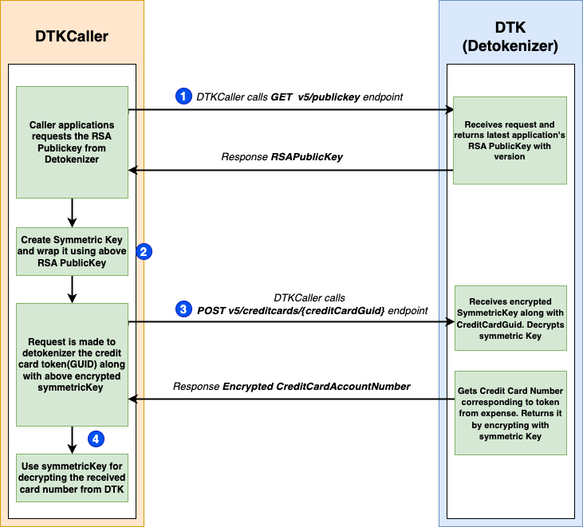
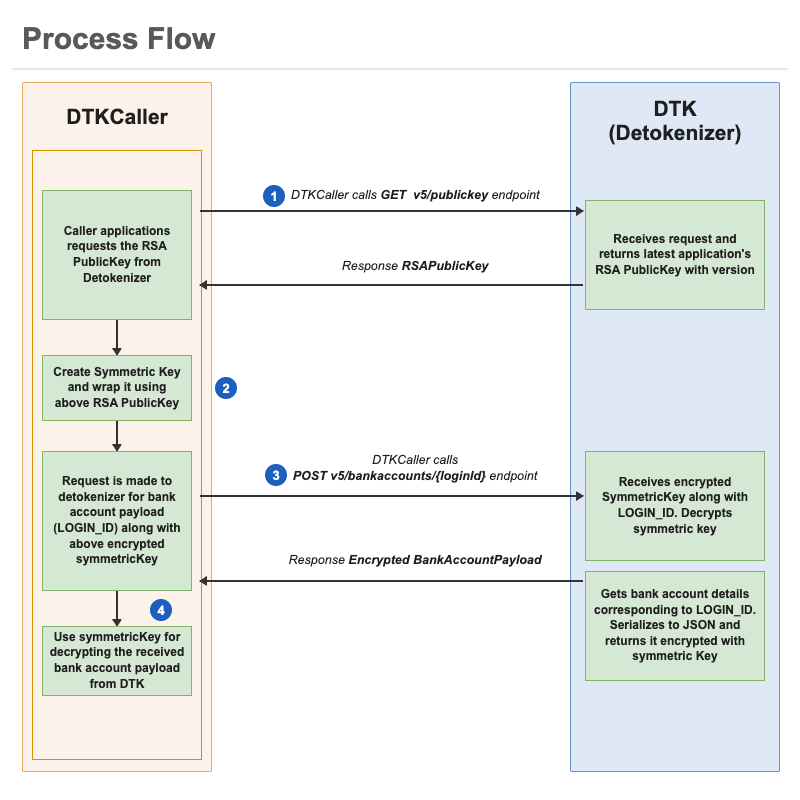

# Detokenizer v5

The Detokenizer v5 API allows clients to retrieve the user's credit card number and bank account details from Concur Expense in a secure way. It returns sensitive data encrypted with a symmetric key that the client provides in the request. The client will be able to decrypt the data using their symmetric key. The Detokenizer v5 API is FIPS compliant so that customers with IBCP card programs can benefit with credit card detokenizer functionality in CCPS environment. This API ensures secure transmission of sensitive data (card number, bank account details) to customers as part of the remittance file creation process running at caller applications like ICS and CWS, in which the full, unmasked data is required for the correct application of payments.

## <a name="authentication"></a>Authentication

Authentication is done via company JWT. The required scope depends on the resource being accessed:

* Credit card endpoints require scope `creditcardaccount.read`
* Banking info endpoint requires scope `bankaccount.details.read`
* The `/v5/publickey` endpoint accepts either scope, as it is a shared prerequisite for both flows

The company JWT refers to the token belonging to the company whose data is being accessed. If a company is accessing data on behalf of another company, then the calling company should invoke the detokenizer API using the JWT of the company that owns the data. For example, if a company XYZ wants to call the detokenizer API on behalf of another company ABC, then the company XYZ should access the API using ABC's company JWT.

## <a name="overview"></a>Overview

The Detokenizer v5 API exposes the following resources and these have to be called sequentially: 

Resource|Description
---|---
`RSAPublicKey`|Retrieve RSA public Key via publickey API.
Credit Card Account Details|Retrieve credit card number via Detokenizer API.
Banking Info|Retrieve bank account details via banking info API.

## <a name="limitations"></a>Limitations

Access to this documentation does not provide access to the API.

This API is only for public use to support various SAP integration features or to the SAP Concur customer that has established corporate credit card accounts involved in the data (the “Customer Corporate Card Holder”). Such use must be in compliance with regulations and other industry standards, including but not limited to Payment Card Industry Data Security Standards (PCI DSS).

These APIs are available in US2, EU2, APJ1 and CCPS environments.
## <a name="process-flow"></a>Process Flow

### Credit Card Detokenization Flow



### Banking Info Detokenization Flow




## <a name="products-editions"></a>Products and Editions

* Concur Expense Professional Edition
* Concur Expense Standard Edition


## Scope Usage <a name="scope-usage"></a>

Name|Description|Endpoint
---|---|---
`creditcardaccount.read`|Reads credit card data from Concur Expense.|POST
`bankaccount.details.read`|Reads bank account data from Concur Expense.|POST

## Dependencies <a name="dependencies"></a>

SAP Concur clients must purchase Concur Expense in order to use this API.

## Access Token Usage <a name="access-token-usage"></a>

This API supports company level access tokens. A Company access token (JWT) is required for these endpoints like mentioned in [Authentication](#authentication).


## <a name="RSAPublicKeyDetail-get"></a>Get RSA Public Key Detail

Endpoint to retrieve RSA public Key. Returns RSA Public key for caller to consume the other V5 API i.e. Get Credit Card Account Details. This key would be used by caller to wrap their own symmetric key which would be passed to Get Credit Card Account Details API.

### Scopes

`creditcardaccount.read` - Refer to [Scope Usage](#scope-usage) for full details.

### Request

```shell
GET https://{region}.api.concursolutions.com/detokenizer/v5/publickey
```

#### Parameters

* None

#### Headers

* [RFC 7235 Authorization](https://tools.ietf.org/html/rfc7235#section-4.2) : Header used for authorization. Should be specified in the format `Bearer JWT_Token`. This is a Company JWT token.
* `concur-correlationid` is a specific custom header used for technical support in the form of a [RFC 4122 A Universally Unique IDentifier (UUID) URN Namespace](https://tools.ietf.org/html/rfc4122)

#### Payload

* None.

### Response

#### <a name="http-status-codes"></a>Status Codes

In case of success, HTTP status code `200 (OK) - RSA Public Key` is returned.

* [401 Unauthorized](https://datatracker.ietf.org/doc/html/rfc7235#section-3.1)
* [403 Forbidden](https://tools.ietf.org/html/rfc7231#section-6.5.3)
* [500 Internal Server Error](https://tools.ietf.org/html/rfc7231#section-6.6.1)

#### Headers

* [RFC 7231 Content-Type](https://tools.ietf.org/html/rfc7231#section-3.1.1.5)
* [RFC 7230 Content-Length](https://tools.ietf.org/html/rfc7230#section-3.3.2)

#### Payload

* [RSA Public Key Response](#rsa-public-key-response)

### Example

#### Request

```shell
GET https://usg.api.concursolutions.com/detokenizer/v5/publickey
concur-correlationid: 87de8598-dbd5-4aea-af9d-988efb61c468
Authorization: Bearer JWT_TOKEN
Accept: application/json
```

#### Success Response

```shell
HTTP/1.1 200 OK
concur-correlationid: 87de8598-dbd5-4aea-af9d-988efb61c468
Content-Type: application/json
Content-Length: 1270
```

```json
{
  "pubKey": "MIIBIjANBgkqhkiG9w0BAQEFAAOCAQ8AMIIBCgKCAQEAuPXJGJKBYiqRsPUrrxs7726KUQa+xiyaZ38CfvgPCUo6KV4WQRSAdudoY7Ut1VKA7tqjcFAV/OWVdqKYG32I4oyfGYGfacCXSSF+HQY6D8WrZg87mtNiZq0SrzQNESfd80ZpbKMEKSN23q7Pjub35YKfHWLn6JZXo+Y+YXW040ghCqNULFvG0EyY6WPalYCfQqV9231kJkyu5L0RLzjfqOLCfu4m+YHgo3FAEhFUrhYTDLMm7nnoGwQQA5Mf+Hcd84FMKIow0t7iv8fPox5uZS7o/RTCZfbGpCkyka5pF0NnkGXvLI5J8JCobO/IAm9DoElSClJznHZwZOtHcQb/gwIDAQAB",
  "version": 5
}
```

#### Error Response
```shell
401 Unauthorized
Content-Type: application/json
```

```json
{
    "timestamp": "2025-05-12T13:24:18.149+00:00",
    "httpStatus": "401 - Unauthorized",
    "errorMessage": "",
    "errorId": "UNAUTHORIZED",
    "path": "/detokenizer/v5/publickey"
}
```

## Get Credit Card Account Details <a name="get-credit-card-account-details"></a>

Returns the credit card number associated with the credit card token by adhering to FIPS standards, with the credit card number encrypted with caller's symmetric key. Caller has to decrypt this Encrypted Credit Card Number using their symmetric key.

### Prerequisite 

* Publickey endpoint needs to be called and symmetricKey needs to be wrapped using same before making request to this API.


### Scopes

`creditcardaccount.read` - Refer to [Scope Usage](#scope-usage) for full details.

### Request

```shell
POST https://{region}.api.concursolutions.com/detokenizer/v5/creditcards/{creditCardGuid}
```

#### Parameters

Name|Type|Format|Description
---|---|---|---
`creditCardGuid`|`string`|-|Credit card GUID is a token which represents a credit card number in Concur Expense. This `creditCardGuid` can be obtained from the `cardAccountID` field available in the Financial Integration Service (FIS) data.

#### Headers

* [RFC 7235 Authorization](https://tools.ietf.org/html/rfc7235#section-4.2) : Header used for authorization. Should be specified in the format 'Bearer JWT_Token'. This is a Company JWT token.
* `concur-correlationid` is a specific custom header used for technical support in the form of a [RFC 4122 A Universally Unique IDentifier (UUID) URN Namespace](https://tools.ietf.org/html/rfc4122)
* [RFC 7231 Content-Type](https://tools.ietf.org/html/rfc7231#section-3.1.1.5)

#### Payload

* [Credit Card Detokenizer Request](#credit-card-detokenizer-request)

### Response

#### <a name="http-status-codes"></a>Status Codes

In case of success, HTTP status code `200 (OK) - Encrypted Credit Card Data` is returned.

* [400 Bad Request](https://tools.ietf.org/html/rfc7231#section-6.5.1)
* [401 Unauthorized](https://datatracker.ietf.org/doc/html/rfc7235#section-3.1)
* [403 Forbidden](https://tools.ietf.org/html/rfc7231#section-6.5.3)
* [404 Not Found](https://tools.ietf.org/html/rfc7231#section-6.5.4)
* [500 Internal Server Error](https://tools.ietf.org/html/rfc7231#section-6.6.1)

#### Headers

* [RFC 7231 Content-Type](https://tools.ietf.org/html/rfc7231#section-3.1.1.5)
* [RFC 7230 Content-Length](https://tools.ietf.org/html/rfc7230#section-3.3.2)

#### Payload
* [Credit Card Number Response](#credit-card-number-response)

### Example

#### Request

```shell
POST https://usg.api.concursolutions.com/detokenizer/v5/creditcards/9D118EDC278B844DB7814072110AC4D9
concur-correlationid: 87de8598-dbd5-4aea-af9d-988efb61c468
Authorization: Bearer JWT_TOKEN
Accept: application/json
Content-Type: application/json
```

```json
{
  "symmetricKey": "R7zgrcT6rpJjtGPXIBSODGDblzPnhQgQ+CKCcwyn7rE8j7FImmNhtETqihB0WQhm1+6v70tKzJsaAMLeucVBEEDcz2sOXgED9WmG6BzhiKgiIJgGcSRTR0QZvdY5LgyI67mhLUT87xsGtUv2ZNkKTR9xkWn3cPrD3tB4bDE296gIRXDLpSadcQAK8gNUfLsuv5c3dfRUdc+B4QdWw8E+hxXR682DIfnpJFSWwoGp9uIao7nJeunXuvkvKfGz0SU1DDu8T4FVlpHJpwuf4a/Kgi+rI/JY0UBOYaW7B5Ne+F7ohcu3Np7SOr2FsSzTAX1X4GH63EstBPtPQr1sTd2yYA==",
  "keyVersion": 5
}
```

#### Response

```shell
HTTP/1.1 200 OK
concur-correlationid: 87de8598-dbd5-4aea-af9d-988efb61c468
Content-Type: application/json
Content-Length: 1270
```

```json
{
  "accountNumber": "dPp0l3xtLvucH+md:EUjJp2eIWgIpjdHjTg0EhJjawdEek5M8gSrJBKHCOtY="
}
```

#### Error Response

```shell
400 Bad Request
Content-Type: application/json
```

```json
{
    "timestamp": "2025-05-12T13:24:18.149+00:00",
    "httpStatus": "400 - Bad Request",
    "errorMessage": "Bad request [keyVersion] received.",
    "errorId": "BAD_REQUEST",
    "path": "/detokenizer/v5/creditcards/059fee21-a340-5043-8b72-583f5c2d10b0"
}
```


## Get Banking Info <a name="get-banking-info"></a>

Returns the most recently modified active bank account for the given `loginId`, with sensitive fields (accountNumber, routingNumber, taxId, secondaryRoutingNumber) decrypted and the full payload re-encrypted with the caller's AES symmetric key.

### Prerequisite

* The `/v5/publickey` endpoint must be called first to obtain the RSA public key. The caller wraps their AES symmetric key with it before making this request.

### Scopes

`bankaccount.details.read` - Refer to [Scope Usage](#scope-usage) for full details.

### Request

```shell
POST https://{region}.api.concursolutions.com/detokenizer/v5/bankaccounts/{loginId}
```

#### Parameters

Name|Type|Format|Description
---|---|---|---
`loginId`|`string`|`path`|**Required** The employee LOGIN_ID (LOGIN_ID column in CT_EMPLOYEE table).

#### Headers

* [RFC 7235 Authorization](https://tools.ietf.org/html/rfc7235#section-4.2) : Header used for authorization. Should be specified in the format `Bearer JWT_Token`. This is a Company JWT token.
* `concur-correlationid` is a specific custom header used for technical support in the form of a [RFC 4122 A Universally Unique IDentifier (UUID) URN Namespace](https://tools.ietf.org/html/rfc4122)
* [RFC 7231 Content-Type](https://tools.ietf.org/html/rfc7231#section-3.1.1.5)

#### Payload

* [Banking Info Detokenizer Request](#banking-info-detokenizer-request)

### Response

#### Status Codes

In case of success, HTTP status code `200 (OK) - Banking Info` is returned.

* [400 Bad Request](https://tools.ietf.org/html/rfc7231#section-6.5.1)
* [401 Unauthorized](https://datatracker.ietf.org/doc/html/rfc7235#section-3.1)
* [403 Forbidden](https://tools.ietf.org/html/rfc7231#section-6.5.3)
* [500 Internal Server Error](https://tools.ietf.org/html/rfc7231#section-6.6.1)

#### Headers

* [RFC 7231 Content-Type](https://tools.ietf.org/html/rfc7231#section-3.1.1.5)
* [RFC 7230 Content-Length](https://tools.ietf.org/html/rfc7230#section-3.3.2)

#### Payload

* [Banking Encrypted Payload Response](#banking-encrypted-payload-response)

### Example

#### Request

```shell
POST https://usg.api.concursolutions.com/detokenizer/v5/bankaccounts/john.doe@example.com
concur-correlationid: 87de8598-dbd5-4aea-af9d-988efb61c468
Authorization: Bearer JWT_TOKEN
Accept: application/json
Content-Type: application/json
```

```json
{
  "symmetricKey": "R7zgrcT6rpJjtGPXIBSODGDblzPnhQgQ+CKCcwyn7rE8j7FImmNhtETqihB0WQhm1+6v70tKzJsaAMLeucVBEEDcz2sOXgED9WmG6BzhiKgiIJgGcSRTR0QZvdY5LgyI67mhLUT87xsGtUv2ZNkKTR9xkWn3cPrD3tB4bDE296gIRXDLpSadcQAK8gNUfLsuv5c3dfRUdc+B4QdWw8E+hxXR682DIfnpJFSWwoGp9uIao7nJeunXuvkvKfGz0SU1DDu8T4FVlpHJpwuf4a/Kgi+rI/JY0UBOYaW7B5Ne+F7ohcu3Np7SOr2FsSzTAX1X4GH63EstBPtPQr1sTd2yYA==",
  "keyVersion": 5
}
```

#### Success Response

```shell
HTTP/1.1 200 OK
concur-correlationid: 87de8598-dbd5-4aea-af9d-988efb61c468
Content-Type: application/json
Content-Length: 512
```

```json
{
  "encryptedPayload": "dPp0l3xtLvucH+md:EUjJp2eIWgIpjdHjTg0EhJjawdEek5M8gSrJBKHCOtY="
}
```

Decrypt `encryptedPayload` with your AES symmetric key (AES/GCM/NoPadding, 128-bit auth tag) to obtain the full [BankingAccountDetails](#banking-account-details) JSON.

#### Error Response

```shell
400 Bad Request
Content-Type: application/json
```

```json
{
    "timestamp": "2026-07-29T10:00:00.000+00:00",
    "httpStatus": "400 - Bad Request",
    "errorMessage": "Bad request [loginId] received.",
    "errorId": "BAD_REQUEST",
    "path": "/detokenizer/v5/bankaccounts/john.doe@example.com"
}
```

## Schemas <a name="schemas"></a>

### <a name="rsa-public-key-response"></a>RSA Public Key Response

Name|Type|Format|Description
---|---|---|---
`pubKey`|`string`|-|Base64 Encoded RSA public key of 2048 bits length.
`version`|`long`|-|Version of RSA public key.

### Credit Card Detokenizer Request <a name="credit-card-detokenizer-request"></a>

Name|Type|Format|Description
---|---|---|---
`symmetricKey`|`string`|-|AES Symmetric Key (256 length with transformation: AES/GCM/NoPadding) which is wrapped with RSA public key (transformation: RSA/ECB/OAEPWithSHA-256AndMGF1Padding). Note: Symmetric key has to be refreshed frequently in the caller side.
`keyVersion`|`long`|-|Version of RSA public key used for wrapping symmetric key.

### Credit Card Number Response<a name="credit-card-number-response"></a>

Name|Type|Format|Description
---|---|---|---
`accountNumber`|`string`|-|This field would consists of 2 parts with colon as delimiter. First Part is Base64 Encoded IV value and Second Part is Based64 Encoded Encrypted credit card number.

### <a name="error-response"></a>Error Response

Name|Type|Format|Description|Example
---|---|---|---|---
`timestamp`|`string`|-|The time when the error was captured.|-
`httpStatus`|`string`|-|The http response code and phrase for the response.|400 - Bad Request; 401 - Unauthorized; 403 - Forbidden; 404 - Not Found; 500 - Internal Server Error
`errorMessage`|`string`|-|The detailed error message. | Bad request [creditCardGUID] received, Bad request [keyVersion] received, Bad request [symmetricKey] received; Unauthorized request; Forbidden request; Not Found; Internal server error. Please contact system administrator.
`errorId`|`string`|-|The unique identifier of the error associated with the response.|BAD_REQUEST; UNAUTHORIZED; FORBIDDEN; NOT_FOUND; INTERNAL_SERVER_ERROR
`path`|`string`|-|The URI of the attempted request.|-

### Banking Info Detokenizer Request <a name="banking-info-detokenizer-request"></a>

Name|Type|Format|Description
---|---|---|---
`symmetricKey`|`string`|-|AES Symmetric Key (256-bit, AES/GCM/NoPadding) wrapped with the RSA public key (RSA/ECB/OAEPWithSHA-256AndMGF1Padding). Note: Symmetric key has to be refreshed frequently on the caller side.
`keyVersion`|`long`|-|Version of the RSA public key used to wrap the symmetric key.

### Banking Encrypted Payload Response <a name="banking-encrypted-payload-response"></a>

Name|Type|Format|Description
---|---|---|---
`encryptedPayload`|`string`|-|The complete bank account payload encrypted with the caller's AES symmetric key. Format: `Base64(IV):Base64(ciphertext)`. Decrypt with AES/GCM/NoPadding (128-bit auth tag) to obtain the [BankingAccountDetails](#banking-account-details) JSON.

### Banking Account Details <a name="banking-account-details"></a>

This is the structure obtained after decrypting `encryptedPayload`.

Name|Type|Format|Description
---|---|---|---
`isActive`|`string`|-|Indicates whether the bank account is active and eligible for transactions.
`accountTypeLangName`|`string`|-|The localized account type (e.g., Checking, Savings) based on user's language preference.
`nameOnAccount`|`string`|-|The name associated with the bank account as registered with the financial institution.
`bankName`|`string`|-|The name of the financial institution or bank.
`branchLocation`|`string`|-|The physical location or branch identifier of the bank.
`addressLine1`|`string`|-|The primary address line for the bank account holder.
`addressLine2`|`string`|-|The secondary address line (e.g., apartment, suite) for the bank account holder.
`city`|`string`|-|The city where the bank account is registered.
`region`|`string`|-|The state, province, or region where the bank account is registered.
`postalCode`|`string`|-|The postal or ZIP code for the bank account address.
`countryCode`|`string`|-|The ISO 2-letter country code where the bank account is registered.
`taxId`|`string`|-|The tax identification number associated with the bank account holder.
`isResident`|`string`|-|Indicates whether the account holder is a resident of the registered country.
`statusCode`|`string`|-|The current status code of the bank account (e.g., CONF, FAIL, PEND).
`currencyCode`|`string`|-|The ISO 4217 currency code for the bank account (e.g., USD, EUR, GBP).
`accountNumber`|`string`|-|The bank account number.
`routingNumber`|`string`|-|The routing number for domestic fund transfers.
`secondaryRoutingNumber`|`string`|-|The secondary routing number, used in some countries for alternate transfer rails.
