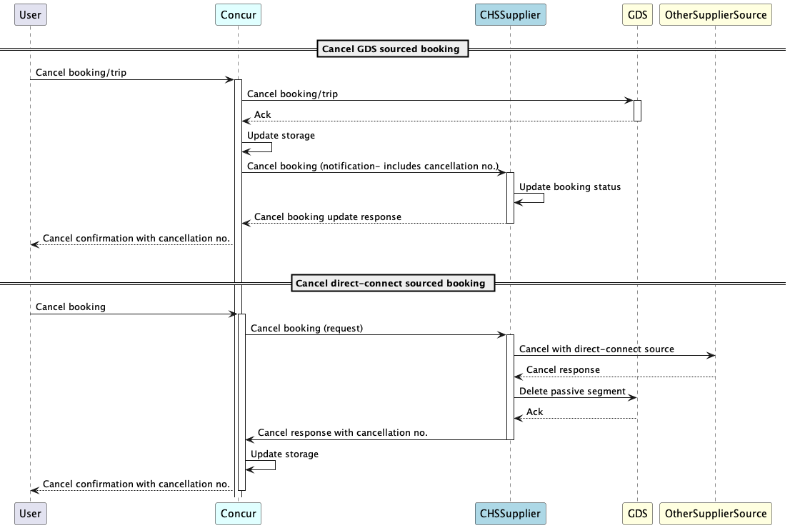

# Single PNR Solution For CHS

**Note: This feature is not yet generally available.**

## Overview
This document describes the design of "Single PNR Solution" for Hotel's direct connect offering of Custom Hotel Source (CHS) program.

For bookings made using CHS today, if passives are enabled, we have two PNRs associated with each hotel booking. Concur creates and manages a PNR in the appropriate GDS for the trip and adds a passive segment to that PNR with details of the hotel booking made by the CHS supplier. The CHS supplier also creates a PNR in the GDS with the active segment. Duplication of PNRs not only causes sync and operational issues but also adds cost for each booking. Hence, in cooperation with CHS suppliers, we have come up with a solution where there is only one PNR created for the CHS hotel booking. This solution will be applicable to both GDS and non-GDS content booked through the CHS supplier.

### Solution

At a high-level, solution consists of:
- Concur passes existing PNR locator or create a shell PNR (if hotel is first booking) to HSv4 endpoint for hotel booking
- TMC/Supplier confirms the hotel booking with their source (GDS or direct-connect) and work on the PNR (segment, remarks etc.) and release it back to Concur. If source is GDS, supplier will create an active segment while if source is direct-connect, supplier will create a passive segment.
- Concur takes the PNR back and perform finishing.
- If GDS booking ("active" segment added by supplier) - all post-booking operations like `Retrieve` and `Cancel` will be managed as `GDS` booking within Concur. That is, HSv4 read and cancel endpoints will not be used and instead Concur will work directly with GDS to read/cancel booking.
- If supplier supports `Modify` flow, Concur will use HSv4 endpoints to allow supplier to reshop and modify the booking.

## Requirements from TMC/Supplier for this solution
- TMC/Supplier will use standard active and passive segment format as required by Concur.
- TMC/Supplier will have option to manage their own passive segment or use current Concur managed solution for passives. If they choose to manage their own passives, they will need to:
  - Disable passive segment creation for CHS bookings to avoid duplicate passive creation for non-gds hotels.
  - Create new passive segment in Concur created PNR along with booking with their direct connect source (as detailed in the design).
  - Cancel passive segment as part of their `cancel` flow along with canceling the booking with their direct connect source.

## Design

### Booking flow

Above sequence diagram shows the flow for booking a hotel using CHS supplier that supports single PNR solution. Highlights of the flow are:
- CHS supplier will never create a GDS PNR with this solution. During booking request, Concur looks up already existing PNR associated with the Trip and travel config used or creates a new shell PNR and associates with the trip.
- Concur obtains an internal lock on the PNR (for 60 secs) and sends the hotel booking request to supplier with the PNR locator.
- If supplier is booking with GDS, they will use this PNR locator to add the active segment to the PNR. If rate to book belongs to direct connect (e.g. Booking.com/Expedia), supplier will book with that direct connect and add a passive segment to PNR referenced by this record locator.
- Once booking is done, Concur will release the PNR lock making PNR available for further changes e.g. adding Air/Car bookings, finishing etc.
- If supplier takes longer than 55 secs, booking transaction will time out.
- If PNR lock times out, lock will be released automatically to allow further actions on this PNR. In order to prevent "Simultaneous access" errors for user, it is necessary for supplier to honor this timeout and stop working on PNR after this. 
- Booking response from supplier is expected to have `ActiveSegmentInConcurPNR` flag to indicate if the active segment was added to Concur PNR or not. This flag will be used to decide if Concur should treat this booking as GDS booking or direct-connect booking for post-booking functions.

### Cancel flow

As mentioned earlier, if `ActiveSegmentInConcurPNR` is set true booking is treated as GDS booking and Concur will manage cancel flow directly with GDS. Though, CHS supplier will still be notified using HSv4's [cancel endpoint](./v4.endpoints.html#cancel-). Note that invocation of `cancel endpoint` is only for notification to allow CHS supplier to perform any cancel related processing in their system and hotel booking with GDS should be already canceled at that time.

#### GDS Booking
- User initiates cancel request and Concur cancels the active segment/trip in GDS and updates storage with `Canceled` status with cancellation no.
- Concur sends `cancel` request to CHS supplier with cancel number. Note here that this request is just acting as a notification to CHS supplier as booking is already canceled in GDS.
- Above `cancel` request can trigger any post-booking processing in CHS supplier system.

#### Direct Connect Booking
- User initiates cancel request and Concur forwards this cancel request to CHS supplier.
- Supplier sends cancel request to their direct connect source and also deletes any related passive segment if they created one for the booking. 
- Cancel response with cancellation no. is returned to Concur which is then stored and displayed to user.

