

The Meetings API lets you create and manage meetings and their attendees within SAP Concur. It supports two primary use cases: **Concur Meetings** created directly within Concur (via the Meetings Admin UI or Joule), and **Third-Party Meetings** created by external partners (for example, Cvent) through API integration.

## <a name="limitations"></a>Limitations

* Access to this documentation does not provide access to the API. Partner applications must be registered and granted the appropriate scopes.
* This is the partner-facing edition of the API. Internal-only operations are not exposed.
* The API is versioned at `v4`. Breaking changes will be delivered in a new version.

## <a name="process-flow"></a>Process Flow

The most common partner flow is: obtain an access token, create a meeting, add its attendees (individually or in bulk), then read or update the meeting and attendees as needed. Removing attendees and deleting the meeting are optional end-of-lifecycle steps.

> **Note to tech writers:** basic flow below (Mermaid). Please restyle to the dev-portal diagram standard.

```mermaid
flowchart TD
    A([Start]) --> B[Obtain OAuth 2.0 token<br/>password grant → Bearer JWT<br/><i>prerequisite: OAuth token endpoint</i>]
    B --> C[POST /meetings<br/>scope: meetings.write<br/>→ returns meetingId]
    C --> D{Add attendees}
    D -->|one| E[POST /meetings/&#123;meetingId&#125;/attendees<br/>scope: meetings.write]
    D -->|many| F[POST /meetings/&#123;meetingId&#125;/attendees/bulk<br/>scope: meetings.write → 207 Multi-Status]
    E --> G[GET meeting / attendees<br/>scope: meetings.read]
    F --> G
    G --> H{Updates needed?}
    H -->|yes| I[PATCH meeting / attendee<br/>merge-patch+json · scope: meetings.write]
    I --> G
    H -->|no| J{End of lifecycle?}
    J -->|remove attendee| K[DELETE /meetings/&#123;meetingId&#125;/attendees/&#123;attendeeId&#125;]
    J -->|delete meeting| L[DELETE /meetings/&#123;meetingId&#125;<br/>soft delete]
    K --> M([End])
    L --> M
    J -->|no| M
```



**Prerequisite calls (other APIs):** the OAuth 2.0 token endpoint is required before any Meetings API call to obtain the Bearer token. No other cross-API prerequisites are required for the core flow.

## <a name="products-editions"></a>Products and Editions

* Concur Travel Professional Edition
* Concur Travel Standard Edition

## <a name="scope-usage"></a>Scope Usage

Name|Description|Endpoint
---|---|---
`meetings.read`|Read meetings, attendees, and history|All `GET` endpoints
`meetings.write`|Create, update, and delete meetings, attendees, and login URLs|All `POST`, `PATCH`, and `DELETE` endpoints

## <a name="dependencies"></a>Dependencies

* **OAuth 2.0 token endpoint** — required to obtain the bearer token used on every request. Partners obtain a User JWT via the OAuth password grant, consistent with other enterprise applications.

## <a name="access-token-usage"></a>Access Token Usage

All requests require an OAuth 2.0 bearer token in the `Authorization: Bearer <token>` header. The API accepts a **User JWT** or **Company JWT**; the company is resolved from the token's company claim.

Meeting-scoped endpoints also accept an optional `companyId` query parameter. When omitted, the company is resolved from the token. When supplied, it **must** match the token's company — a mismatch returns `403`, and a malformed value returns `400`.

## <a name="base-uris"></a>Base URIs

* US Production: `https://us.api.concursolutions.com/meetings/v4`
* EMEA Production: `https://emea.api.concursolutions.com/meetings/v4`

Refer to [Base URIs](/platform/base-uris.html) for details on selecting the correct instance URL.

## <a name="errors"></a>Error Handling

Errors are returned using the standard SAP Concur error envelope. Handle `errorCode` programmatically; `errorMessage` is intended for logging.

```json
{
  "errors": [
    { "errorCode": "ATTENDEE_NOT_FOUND", "errorMessage": "Attendee does not exist: <id>" }
  ]
}
```

See the [Meetings v4 Endpoints](/api-reference/travel/v4.meetings-endpoints.html) page for the full list of operations, payloads, and schemas.
